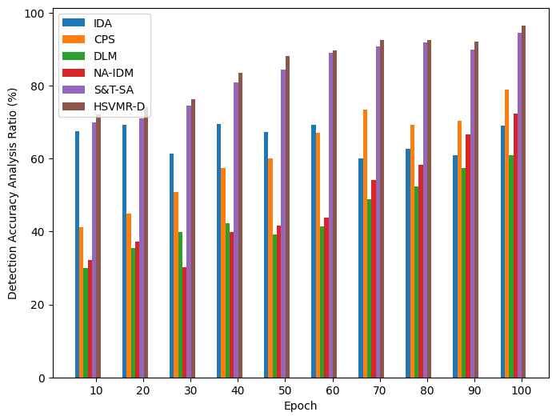
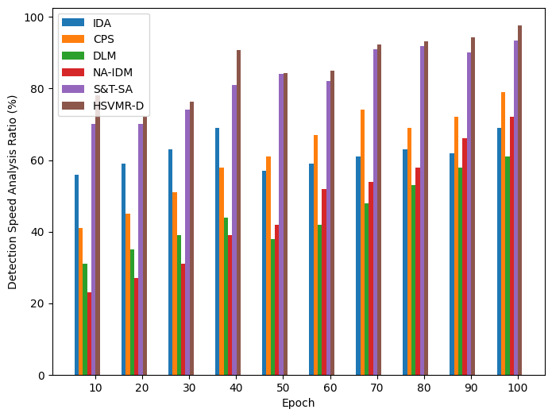
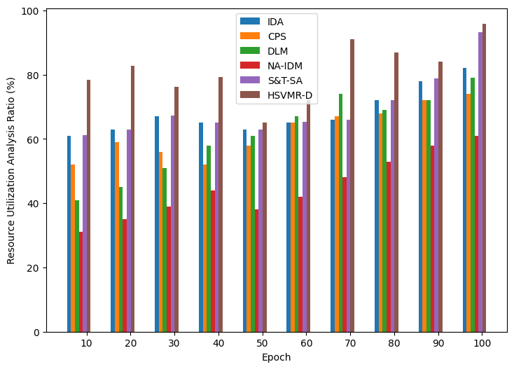
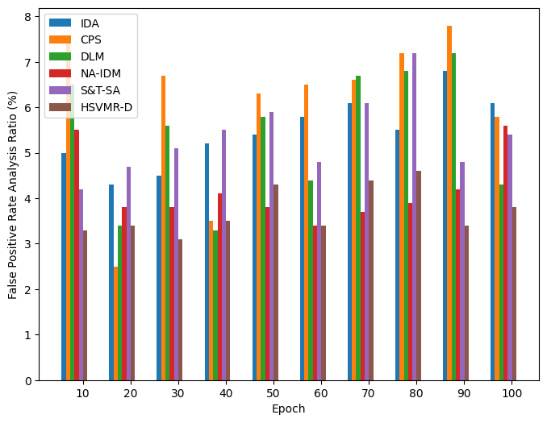
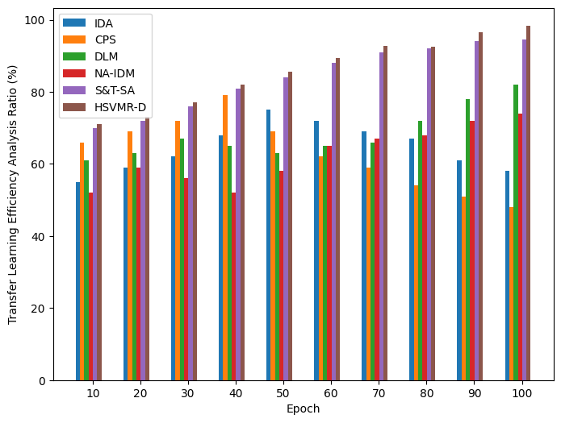
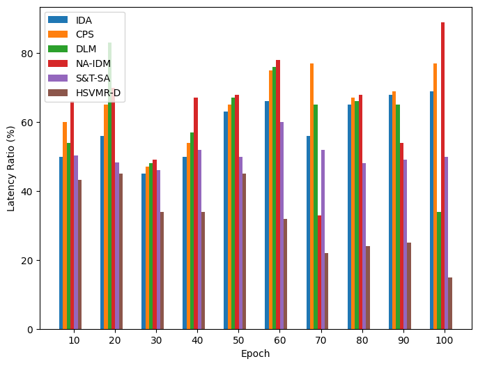
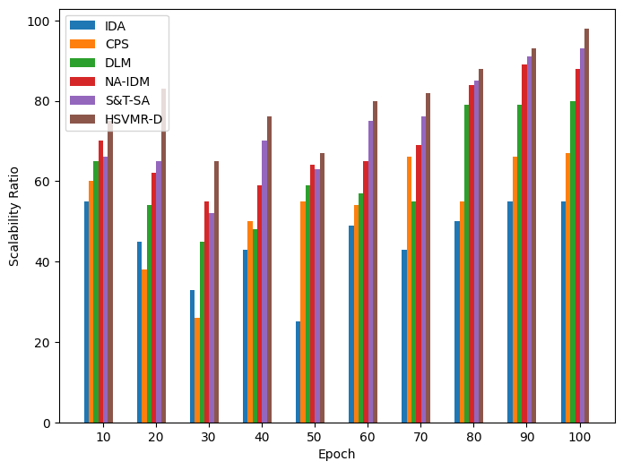

<h1 align="center">A Hybrid Support Vector Machines Rule-Based Detection for IoT Cyber Threat Detection</h1>

<p align="center">
  
  
  
  
  
  
</p>

<p align="center">
  Source code, dataset, experimental plots, and manuscript materials for the HSVMR-D IoT cyber-threat detection framework.
</p>

---

## Overview

<div align="justify">

The rapid growth of the <strong>Internet of Things (IoT)</strong> has created highly heterogeneous networks containing sensors, embedded devices, gateways, controllers, and cyber-physical systems. These environments are difficult to secure because devices differ in capability, network behavior changes over time, computational resources are limited, and both known and previously unseen attack patterns may appear.

<strong>HSVMR-D</strong> is a hybrid cyber-threat detection framework designed to combine complementary detection strategies instead of relying on a single classifier. The published work describes the approach as a <strong>Hybrid Support Vector Machines Rule-Based Detection</strong> method. In the accompanying notebook, the final decision combines an <strong>RBF Support Vector Machine (SVM)</strong>, a lightweight <strong>statistical deviation detector</strong>, and a <strong>rule-based detector</strong> through majority voting.

The repository also implements several comparison models, performs preprocessing and feature engineering, exports manuscript-style comparison tables, and produces figures for detection accuracy, detection speed, resource utilization, false-positive rate, transfer-learning efficiency, latency, and scalability.

</div>

---

## Publication

This repository accompanies the following article:

> **A hybrid approach using support vector machine rule-based system: detecting cyber threats in internet of things**  
> M. Wasim Abbas Ashraf, Arvind R. Singh, A. Pandian, Rajkumar Singh Rathore, Mohit Bajaj, and Ievgen Zaitsev  
> *Scientific Reports*, **14**, 27058 (2024)  
> DOI: https://doi.org/10.1038/s41598-024-78976-1

The manuscript PDF is included in the repository as:

```text
A hybrid approach using support.pdf
```

---

## What Makes HSVMR-D Different

- **Hybrid detection instead of a single classifier**: combines machine-learning, statistical, and rule-based decisions.
- **RBF SVM for learned threat classification**: captures nonlinear relationships in engineered IoT features.
- **Statistical deviation analysis**: provides a lightweight anomaly-oriented signal in addition to supervised classification.
- **Rule-based reasoning**: uses interpretable feature-distribution conditions to flag suspicious observations.
- **Majority-vote threat decision**: a sample is marked as a threat when at least two of the three HSVMR-D components vote for the threat class.
- **Feature engineering**: augments original IoT attributes with row-wise mean, standard deviation, extrema, range, and energy.
- **Resource-conscious design goal**: the published method is motivated by threat detection in heterogeneous and resource-constrained IoT environments.
- **Multiple comparison methods**: the notebook includes SVM, Random Forest, statistical detection, and the proposed hybrid decision logic.
- **Experiment-oriented output**: the repository contains manuscript figures and notebook code for exporting comparison CSV files and regenerating plots.

---

## Visual Overview

### Included experimental figures

The repository contains the following result figures.

| Detection Accuracy | Detection Speed |
|---|---|
|  |  |

| Resource Utilization | False Positive Rate |
|---|---|
|  |  |

| Transfer-Learning Efficiency | Latency |
|---|---|
|  |  |

| Scalability |
|---|
|  |

---

## Unified HSVMR-D Workflow

```text
Raw IoT observations
        |
        v
Data preprocessing
(drop duplicates + handle missing values)
        |
        v
Robust feature scaling
        |
        v
Feature engineering
(mean, std, max, min, range, energy)
        |
        v
Stratified train/test split
        |
        +--------------------+--------------------+
        |                    |                    |
        v                    v                    v
 SVM detector     Statistical detector    Rule-based detector
  learned pattern       deviation signal       interpretable rules
        |                    |                    |
        +--------------------+--------------------+
                             |
                             v
                     Majority-vote fusion
                      at least 2 of 3
                             |
                             v
                  Threat / Non-Threat decision
                             |
                             v
      Evaluation, comparison tables, and result plots
```

<div align="justify">

The central idea is to optimize the IoT environment and accurately and timely detect cyber threats using a combination of machine learning, rule-based, and time-series approaches. 

</div>

---

## Method Summary

### 1) Dataset preparation

The notebook loads a CSV file and expects the class label to be stored in:

```python
target = 'Threat_Label'
```

It then removes duplicate rows and fills missing values:

```python
df = df.drop_duplicates()

for col in df.columns:
    if df[col].isnull().sum() > 0:
        if df[col].dtype != 'object':
            df[col] = df[col].fillna(df[col].median())
        else:
            df[col] = df[col].fillna(df[col].mode()[0])
```

The target labels are converted to numeric values with `LabelEncoder`.

For the dataset included in this repository, the resulting mapping is:

```text
Non-Threat -> 0
Threat     -> 1
```

### 2) Robust scaling

The raw input attributes are normalized with `RobustScaler`:

```python
scaler = RobustScaler()
X_scaled = pd.DataFrame(
    scaler.fit_transform(X),
    columns=X.columns
)
```

Robust scaling is useful when features may contain values whose distributions are not well represented by a simple mean and standard deviation.

### 3) Feature engineering

The notebook constructs six additional row-level features:

```python
def generate_features(data):
    engineered = pd.DataFrame(index=data.index)

    engineered['mean_value'] = data.mean(axis=1)
    engineered['std_value'] = data.std(axis=1)
    engineered['maximum'] = data.max(axis=1)
    engineered['minimum'] = data.min(axis=1)
    engineered['range'] = engineered['maximum'] - engineered['minimum']
    engineered['energy'] = np.sum(np.square(data), axis=1)

    return engineered
```

For the provided CSV, there are three original input features. After feature engineering, each sample contains:

```text
3 original features + 6 engineered features = 9 model features
```

### 4) Stratified train/test split

The notebook uses an 80/20 split while preserving the class distribution:

```python
X_train, X_test, y_train, y_test = train_test_split(
    X_final,
    y_encoded,
    test_size=0.2,
    random_state=42,
    stratify=y_encoded
)
```

With the included 1,000-row dataset, this produces approximately:

```text
Training samples : 800
Testing samples  : 200
```

---

## HSVMR-D Detection Components

### Component A: RBF Support Vector Machine

The supervised component uses an RBF-kernel SVM:

```python
IDA = SVC(
    kernel='rbf',
    probability=True,
    random_state=42
)

IDA.fit(X_train, y_train)
svm_prediction = IDA.predict(X_test)
```

An SVM attempts to separate classes using a maximum-margin decision boundary. The RBF kernel extends this to nonlinear class boundaries by comparing samples through a radial basis function.

Conceptually:

```text
engineered IoT feature vector
            |
            v
        RBF kernel
            |
            v
 nonlinear separating boundary
            |
            v
     Threat / Non-Threat
```

### Component B: statistical deviation detector

The final hybrid voting code uses a compact statistical detector based on each test sample's mean feature value:

```python
train_mean = X_train.mean()

deviation = abs(
    X_test.mean(axis=1) - train_mean.mean()
)

ST_prediction = np.where(
    deviation > deviation.mean(),
    1,
    0
)
```

This creates a binary anomaly signal:

```text
large deviation from the training-center proxy -> Threat vote
smaller deviation                           -> Non-Threat vote
```

The notebook also contains a second statistical-anomaly calculation based on the average absolute difference from the training profile and a 70th-percentile threshold:

```python
normal_profile = X_train.describe()

stat_score = []
for _, row in X_test.iterrows():
    deviation = np.mean(abs(row - normal_profile.loc['mean']))
    stat_score.append(deviation)

threshold = np.percentile(stat_score, 70)
stat_output = np.where(stat_score > threshold, 1, 0)
```

In the current notebook, `stat_output` is calculated but is **not** used in the final HSVMR-D majority vote; the final hybrid uses `ST_prediction`.

### Component C: rule-based detector

The rule engine evaluates three distribution-oriented conditions for every observation:

```python
def rule_engine(data):
    result = []

    for _, row in data.iterrows():
        score = 0

        if row.mean() > data.mean().mean():
            score += 1

        if row.std() > data.std().mean():
            score += 1

        if row.max() > data.max().mean():
            score += 1

        result.append(1 if score >= 2 else 0)

    return np.array(result)
```

The three rules examine whether a sample has:

1. an unusually high row mean,
2. an unusually high row standard deviation, and
3. an unusually high row maximum.

A sample receives a rule-based threat vote when at least two conditions are satisfied.

---

## Hybrid Decision Rule

The proposed notebook implementation fuses the three detector outputs using majority voting:

```python
HSVMR_prediction = []

for a, b, c in zip(
    svm_prediction,
    ST_prediction,
    rule_prediction
):
    HSVMR_prediction.append(
        1 if a + b + c >= 2 else 0
    )

HSVMR_prediction = np.array(HSVMR_prediction)
```

Mathematically, for sample `i`:

```text
HSVMR-D(i) = 1,  if SVM(i) + ST(i) + Rule(i) >= 2
             0,  otherwise
```

where:

```text
1 = Threat
0 = Non-Threat
```

This means the final output does not depend on a single detector. At least two detection components must agree before the sample is marked as a threat.

---

## Architecture Details

### 1) Data layer

The data layer provides IoT feature observations and a binary threat label. The included CSV contains numeric feature columns and the `Threat_Label` target.

### 2) Preprocessing layer

The preprocessing stage performs:

- duplicate removal,
- missing-value handling,
- label encoding,
- robust scaling, and
- train/test preparation.

### 3) Feature-engineering layer

Six summary features are computed for each observation:

- row mean,
- row standard deviation,
- maximum,
- minimum,
- range, and
- squared-energy sum.

These features augment the raw measurements with simple distribution and magnitude descriptors.

### 4) Learned classification layer

The primary learned detector is an RBF SVM. The repository also implements additional machine-learning baselines for comparison.

### 5) Statistical/anomaly layer

The notebook contains deviation-based logic as well as an Isolation Forest baseline. These components represent the anomaly-detection side of the experimental framework.

### 6) Rule layer

The deterministic rule engine converts feature-level conditions into a binary threat vote. This is intended to complement the data-driven model with transparent decision logic.

### 7) Fusion layer

SVM, statistical, and rule-based votes are fused by a simple 2-of-3 majority decision.

### 8) Analysis layer

The notebook exports experiment comparison tables and regenerates the seven figures stored at repository root.

---

## Baseline and Comparison Models

The notebook uses the following labels in its experiment code and figures:

| Label | Notebook implementation | Role in the repository |
|---|---|---|
| `IDA` | `SVC(kernel='rbf', probability=True)` | SVM-based supervised classifier |
| `CPS` | `RandomForestClassifier(n_estimators=200)` | Tree-ensemble comparison model |
| `DLM` | `MLPClassifier(hidden_layer_sizes=(64, 32))` | Feed-forward neural-network comparison model |
| `NA-IDM` | `IsolationForest(contamination='auto')` | Unsupervised anomaly-detection comparison |
| `S&T-SA` / `ST_prediction` | Mean-deviation statistical rule in the notebook | Statistical/time-series-oriented comparison signal |
| `HSVMR-D` | Majority vote of SVM + statistical detector + rule engine | Proposed hybrid notebook implementation |

<div align="justify">

The labels correspond to the terminology used by the manuscript and plots, while the table above states the concrete scikit-learn implementation present in this repository. This distinction is useful when reproducing the code because the notebook is the authoritative source for the executable model definitions.

</div>

---

## Dataset Included in This Repository

The repository contains:

```text
iot_threat_data.csv
```

The included file has the following shape:

```text
Rows    : 1,000
Columns : 4
```

Columns:

```text
Feature_A
Feature_B
Feature_C
Threat_Label
```

Class distribution in the provided file:

```text
Threat      : 514
Non-Threat  : 486
```

The current file contains no missing values and no duplicate rows, although the notebook still includes preprocessing logic to handle those cases.

Example structure:

```text
Feature_A,Feature_B,Feature_C,Threat_Label
0.374540,0.185133,1,Threat
0.950714,0.541901,0,Threat
0.731994,0.872946,0,Threat
...
```

### Relationship to the publication

The paper discusses evaluation using a synthetic cybersecurity dataset and cites the Incribo cyber-security dataset resources. The repository CSV is a compact 1,000-sample binary dataset prepared for the accompanying notebook workflow. Researchers reproducing the complete publication experiments should therefore verify the exact dataset/version and preprocessing protocol required by the paper before treating the compact CSV as a full replacement for every manuscript experiment.

---

## Code Tour

The implementation is concentrated in a single Colab notebook:

```text
HSVMR_D_F_SR_GColab.ipynb
```

### Notebook setup

The first cell installs/imports the main dependencies:

```python
pandas
numpy
scikit-learn
matplotlib
seaborn
scipy
openpyxl
```

It also creates a generated output folder:

```python
os.makedirs('results', exist_ok=True)
```

and sets:

```python
RANDOM_STATE = 42
np.random.seed(RANDOM_STATE)
```

### Dataset upload

The notebook is written for Google Colab and uses:

```python
from google.colab import files
uploaded = files.upload()
```

After upload, the first uploaded file is read as CSV.

### Preprocessing

The next stage:

- inspects the dataset,
- removes duplicates,
- imputes missing values,
- separates features and labels,
- label-encodes `Threat_Label`, and
- applies `RobustScaler`.

### Feature generation

The notebook derives six statistical summary features and concatenates them with the scaled original inputs.

### Model fitting

The train/test data are used to fit:

```text
SVC
RandomForestClassifier
MLPClassifier
IsolationForest
```

as well as lightweight statistical and rule-based logic.

### HSVMR-D fusion

The final hybrid decision combines:

```text
SVM prediction
+
statistical prediction
+
rule prediction
```

with a 2-of-3 threshold.

### Experiment export

A later notebook cell creates seven `pandas.DataFrame` objects containing comparison values over epochs:

```text
10, 20, 30, ..., 100
```

and writes them to:

```text
results/Detection_Accuracy_Analysis.csv
results/Detection_Speed_Analysis.csv
results/Resource_Utilization_Analysis.csv
results/False_Positive_Rate_Analysis.csv
results/Transfer_Learning_Efficiency_Analysis.csv
results/Latency_Analysis.csv
results/Scalability_Analysis.csv
```

### Plot generation

The final notebook cells read those generated CSV files and create:

```text
detection_accuracy_analysis_ratio.png
detection_speed_analysis_ratio.png
resource_utilization_analysis_ratio.png
false_positive_rate_analysis_ratio.png
transfer_learning_efficiency_analysis_ratio.png
latency_ratio.png
scalability_ratio.png
```

---

## Repository Structure

```text
.
├── A hybrid approach using support.pdf
├── HSVMR_D_F_SR_GColab.ipynb
├── README.md
├── README.txt
├── iot_threat_data.csv
├── detection_accuracy_analysis_ratio.png
├── detection_speed_analysis_ratio.png
├── false_positive_rate_analysis_ratio.png
├── latency_ratio.png
├── resource_utilization_analysis_ratio.png
├── scalability_ratio.png
└── transfer_learning_efficiency_analysis_ratio.png
```

After running the experiment-export cells, the notebook additionally creates:

```text
results/
├── Detection_Accuracy_Analysis.csv
├── Detection_Speed_Analysis.csv
├── False_Positive_Rate_Analysis.csv
├── Latency_Analysis.csv
├── Resource_Utilization_Analysis.csv
├── Scalability_Analysis.csv
└── Transfer_Learning_Efficiency_Analysis.csv
```

---

## Experiment Metrics

The publication and repository figures consider seven major analysis dimensions.

### Detection accuracy

Measures the proportion of predictions that are correct:

```text
Accuracy = Correct predictions / Total predictions
```

The manuscript-style comparison array stored in the notebook reaches `96.5` for HSVMR-D at epoch 100.

### Detection speed

Represents the experiment's relative threat-detection speed/rate comparison. The stored HSVMR-D series reaches `97.7` at epoch 100.

### Resource utilization

Represents the relative resource-utilization analysis used by the manuscript comparison. The stored HSVMR-D series reaches `95.9` at epoch 100.

### False-positive rate

Measures benign observations incorrectly labeled as attacks. Lower values are preferable. The stored HSVMR-D series reports `3.8` at epoch 100.

### Transfer-learning efficiency

Represents the manuscript's comparison of adaptation/knowledge-transfer behavior across methods. The stored HSVMR-D series reaches `98.4` at epoch 100.

### Latency

Represents the latency comparison in the experiment arrays. Lower values are preferable. The stored HSVMR-D value at epoch 100 is `15`.

### Scalability

Represents the relative scalability comparison as experiment size/epochs increase. The stored HSVMR-D series reaches `98` at epoch 100.

> **Important:** These seven plotted series are explicitly defined as numeric arrays in the notebook and then exported to CSV. They are not automatically calculated from the current `y_test` and model predictions. See **Reproducibility and Implementation Notes** below.

---

## Installation

### Option 1: Google Colab

The notebook is directly structured for Colab.

1. Open `HSVMR_D_F_SR_GColab.ipynb` in Google Colab.
2. Run the dependency/import cell.
3. Run the dataset-upload cell.
4. Upload `iot_threat_data.csv` when prompted.
5. Run the remaining cells in order.

### Option 2: Local Python environment

Create and activate a virtual environment:

```bash
python -m venv .venv
```

Linux/macOS:

```bash
source .venv/bin/activate
```

Windows PowerShell:

```powershell
.venv\Scripts\Activate.ps1
```

Install dependencies:

```bash
pip install pandas numpy scikit-learn matplotlib seaborn scipy openpyxl jupyter
```

Start Jupyter:

```bash
jupyter notebook
```

Then open:

```text
HSVMR_D_F_SR_GColab.ipynb
```

Because the current data-loading cell uses `google.colab.files.upload()`, a local Jupyter run should replace that cell with:

```python
import pandas as pd

df = pd.read_csv('iot_threat_data.csv')
print(df.shape)
display(df.head())
```

---

## Quick Start

### Google Colab workflow

```text
1. Upload/open HSVMR_D_F_SR_GColab.ipynb
2. Run the setup cell
3. Upload iot_threat_data.csv when prompted
4. Run preprocessing and feature-engineering cells
5. Train the comparison models
6. Run the HSVMR-D hybrid voting cell
7. Run the result-export cell
8. Run the plotting cells
```

### Expected generated artifacts

After the export and plotting stages, you should have:

```text
results/*.csv
```

plus regenerated PNG figures for the seven analysis categories.

---

## How to Read the Repository for the First Time

1. `README.md` - understand the complete project workflow.
2. `A hybrid approach using support.pdf` - read the published motivation, mathematical framework, and experimental discussion.
3. `iot_threat_data.csv` - inspect the compact binary classification dataset supplied with the repository.
4. `HSVMR_D_F_SR_GColab.ipynb` - follow the executable preprocessing, modeling, hybrid-vote, export, and plotting workflow.
5. `detection_accuracy_analysis_ratio.png` - inspect the main accuracy comparison.
6. `false_positive_rate_analysis_ratio.png` - inspect false-positive behavior.
7. The remaining PNG files - inspect speed, resource, transfer, latency, and scalability comparisons.

---

## Reproducibility and Implementation Notes

<div align="justify">

The repository is useful as a compact implementation companion to the paper, but several details are important when reproducing experiments or extending the notebook into a stricter research pipeline.

</div>

### 1) Fixed random seed

The notebook uses:

```python
RANDOM_STATE = 42
np.random.seed(RANDOM_STATE)
```

and supplies `random_state=42` to the main stochastic scikit-learn models.

### 2) Comparison curves are stored arrays

The accuracy, detection-speed, resource-utilization, false-positive, transfer-efficiency, latency, and scalability CSVs are built from values written directly in the notebook. The PNGs visualize those arrays.

Therefore, there are two distinct experiment paths:

```text
A. Executable classifier path
   dataset -> preprocessing -> models -> predictions

B. Manuscript comparison-figure path
   fixed arrays -> CSV files -> PNG plots
```

When extending the repository, a useful next step is to replace the fixed experiment arrays with metrics computed programmatically from repeated training/evaluation runs.

### 3) Scaling is currently performed before the train/test split

The notebook fits `RobustScaler` on the complete feature matrix before splitting the data. For strict held-out evaluation, it is preferable to:

```text
split first
     -> fit scaler only on X_train
     -> transform X_train and X_test using the fitted training scaler
```

This prevents information from the test-set feature distribution from contributing to preprocessing parameters.

### 4) The rule engine uses aggregate statistics from the supplied evaluation data

The current call is:

```python
rule_prediction = rule_engine(
    X_test.reset_index(drop=True)
)
```

Inside the function, the thresholds are derived from `data.mean()`, `data.std()`, and `data.max()`. For deployment or strict evaluation, thresholds should normally be learned or calibrated from training/validation data and then frozen before evaluation.

### 5) The final hybrid uses `ST_prediction`, not `stat_output`

Both statistical paths exist in the notebook. The 70th-percentile anomaly result (`stat_output`) is not currently included in the final 2-of-3 vote. Any experiment that changes this fusion rule should document which statistical signal is used.

### 6) The hybrid vote assumes binary classes

The fusion rule sums three predictions and compares the sum with `2`. This is appropriate for the included binary encoding:

```text
0 = Non-Threat
1 = Threat
```

A multiclass version would require a different fusion strategy.

### 7) "Epoch" in the figure-export section is an experiment-axis label

The comparison arrays are indexed by values `10` through `100`. The scikit-learn models used in the notebook do not all train through a shared epoch loop, so these plotted epoch values should not be interpreted as a single synchronized gradient-training schedule across all methods.

---

## Extending the Repository

The current notebook provides a compact research prototype. Natural extensions include:

- moving preprocessing into a scikit-learn `Pipeline`,
- fitting all preprocessing only on training data,
- adding cross-validation,
- calculating accuracy, precision, recall, F1, ROC-AUC, and FPR directly from predictions,
- replacing fixed plotting arrays with repeated measured experiments,
- adding explicit validation data for rule/anomaly threshold calibration,
- performing SVM hyperparameter optimization over `C` and `gamma`,
- evaluating calibrated SVM probabilities,
- adding feature-selection experiments,
- testing robustness against class imbalance,
- evaluating additional public IoT intrusion datasets,
- measuring actual wall-clock inference latency and memory/CPU utilization,
- adding model serialization with `joblib`,
- separating training, evaluation, and plotting into reusable Python modules, and
- adding unit tests for preprocessing, feature engineering, and voting logic.

---

## Suggested Modular Project Layout

For a larger research or production version, the current notebook can be reorganized as:

```text
.
├── data/
│   └── iot_threat_data.csv
├── notebooks/
│   └── HSVMR_D_F_SR_GColab.ipynb
├── src/
│   └── hsvmrd/
│       ├── preprocessing.py
│       ├── features.py
│       ├── detectors.py
│       ├── rules.py
│       ├── fusion.py
│       └── evaluation.py
├── scripts/
│   ├── train.py
│   ├── evaluate.py
│   └── plot_results.py
├── results/
├── figures/
├── tests/
├── requirements.txt
└── README.md
```

This is only a recommended extension; the repository currently uses the simpler single-notebook structure documented above.

---

## Key Dependencies

| Package | Purpose |
|---|---|
| `pandas` | Dataset loading, preprocessing, and CSV export |
| `numpy` | Numerical operations and hybrid-vote arrays |
| `scikit-learn` | Scaling, label encoding, train/test split, SVM, Random Forest, MLP, Isolation Forest, metrics |
| `matplotlib` | Experimental figure generation |
| `seaborn` | Visualization support imported by the notebook |
| `scipy` | Scientific-computing dependency installed by the notebook |
| `openpyxl` | Spreadsheet support installed by the notebook |
| `Jupyter` / `Google Colab` | Interactive execution environment |

---

## Research Interpretation

The repository can be understood as a three-evidence threat detector:

```text
SVM evidence
    -> What class does the learned nonlinear decision boundary predict?

Statistical evidence
    -> Does this observation deviate sufficiently from a reference behavior?

Rule evidence
    -> Does this observation satisfy enough suspicious feature-distribution rules?

Fusion
    -> Do at least two independent signals agree that the sample is a threat?
```

The approach is intended to balance complementary strengths:

```text
Machine learning -> flexible pattern recognition
Statistics       -> lightweight anomaly sensitivity
Rules            -> interpretable known-pattern logic
Voting           -> combined decision robustness
```

---

## Paper-to-Code Mapping

The manuscript presents a broader HSVMR-D framework involving IoT data preprocessing, feature extraction, SVM-based threat detection, statistical/time-series analysis, rule-based detection, threat analysis, model adaptation, and transfer-learning concepts.

The current repository notebook concretely implements the following subset:

```text
Paper concept                     Repository implementation
-------------                     -------------------------
IoT data preprocessing         -> duplicate/missing handling + RobustScaler
Feature extraction             -> six row-wise engineered features
SVM threat detection           -> RBF SVC
Statistical analysis           -> deviation-based binary detectors
Rule-based detection           -> three-condition score rule
Hybrid threat decision         -> 2-of-3 majority vote
Baseline comparison            -> SVC / RF / MLP / Isolation Forest / statistical rule
Experiment tables              -> predefined DataFrames exported to CSV
Experiment figures             -> Matplotlib bar plots
```

Transfer learning and some of the more elaborate mathematical/adaptation mechanisms discussed in the publication are represented primarily through the manuscript and comparison analysis; they are not implemented as a full pretrained-model transfer-learning training pipeline in the current notebook.

---

## Citation

If this repository or the HSVMR-D method supports your research, cite the associated Scientific Reports article:

```bibtex
@article{ashraf2024hybrid,
  title   = {A hybrid approach using support vector machine rule-based system: detecting cyber threats in internet of things},
  author  = {Ashraf, M. Wasim Abbas and Singh, Arvind R. and Pandian, A. and Rathore, Rajkumar Singh and Bajaj, Mohit and Zaitsev, Ievgen},
  journal = {Scientific Reports},
  volume  = {14},
  pages   = {27058},
  year    = {2024},
  doi     = {10.1038/s41598-024-78976-1}
}
```

---

## Contact

For repository-related questions, use the contact information provided with the original project:

```text
wasics117@gmail.com
```

For publication-specific correspondence, consult the author information in the included manuscript.

---

## Acknowledgment

This repository contains the source notebook, compact dataset, experimental figures, and manuscript associated with the HSVMR-D cyber-threat detection study. The project is intended to support understanding, reproduction, extension, and comparative analysis of hybrid machine-learning and rule-based approaches for IoT security.
